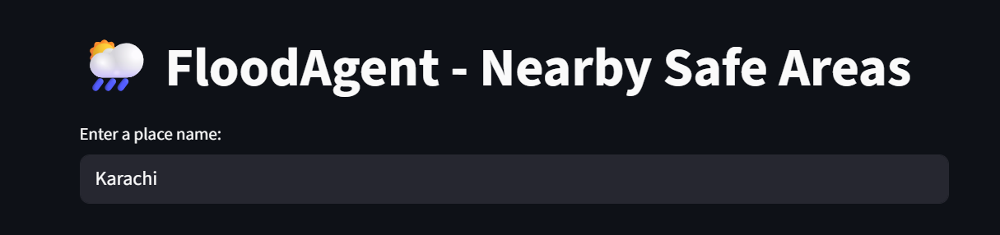
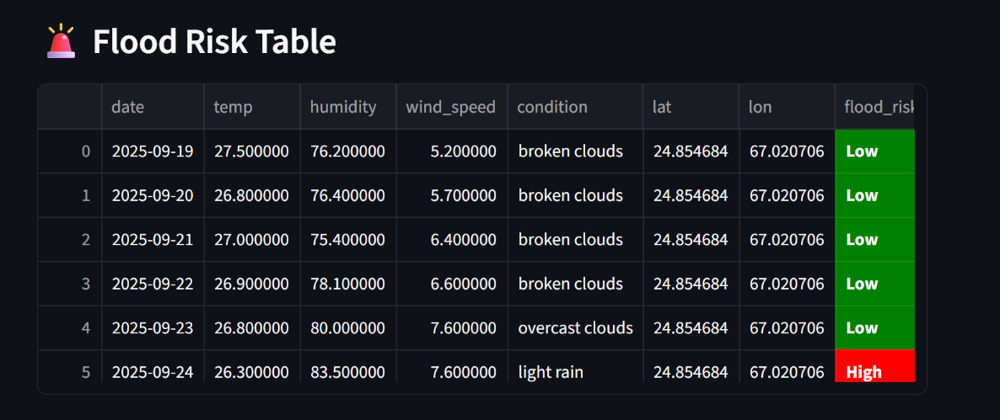
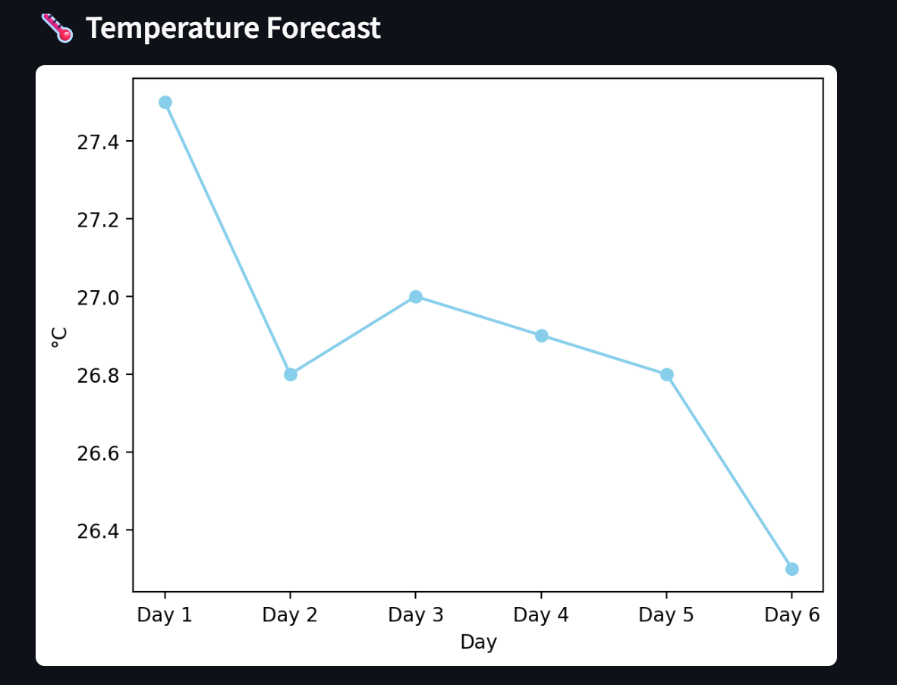
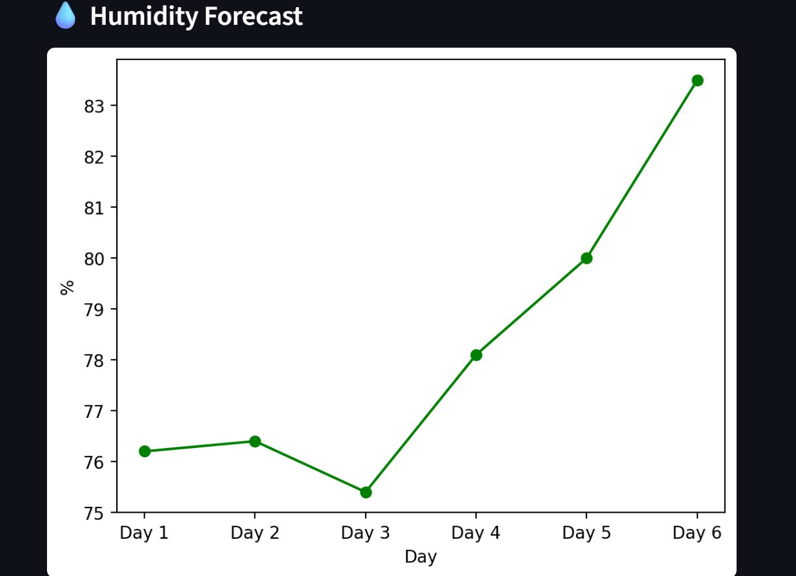
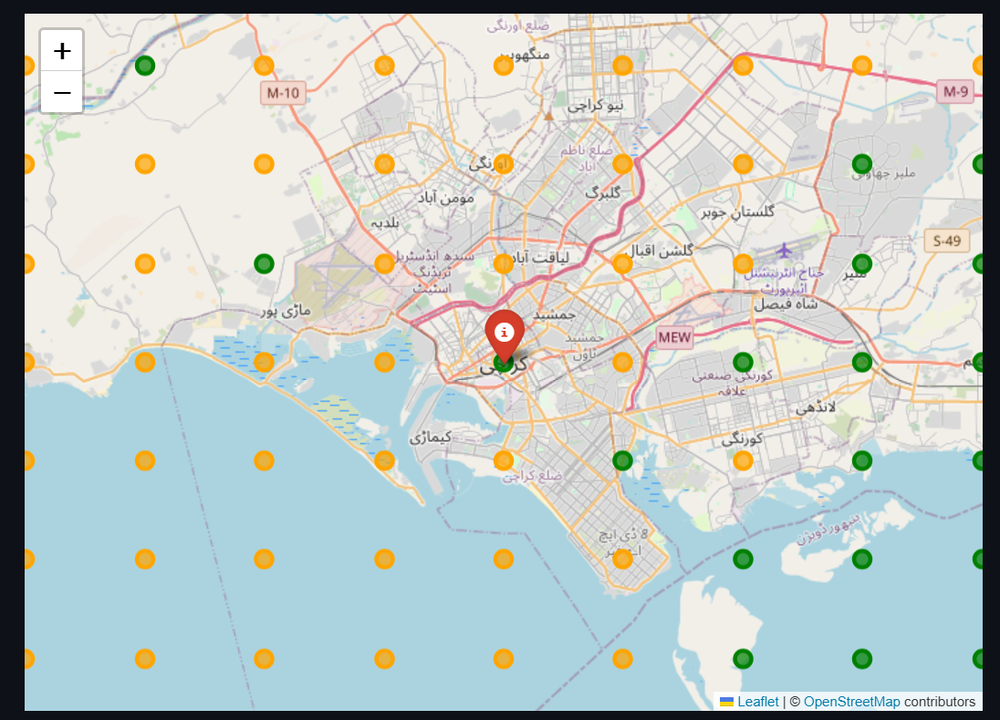

# 🌊 Flood Forecasting Agent

An AI-powered **Internet of Agents** solution for predicting flood risks and locating nearby safe places.

## 🚀 Features
- **Flood Risk Agent** → Predicts possible flooding in a given location using weather + geodata.
- **Safety Agent** → Suggests nearby safe locations if the area is at risk.
- **Streamlit UI** → Simple interface with tables, charts, and interactive maps.

## 📂 Project Structure

flood-forecasting-agent/
├── app.py                # Main Streamlit app (UI + calls agents)
├── agents.py             # Defines FloodRiskAgent & SafetyAgent wrappers
├── flood_agent.py        # Flood risk prediction logic
├── safety_agent.py       # Safe places logic
├── data_fetcher.py       # Functions for coordinates, forecast, nearby locations
├── risk_calculator.py    # Flood risk calculation rules
├── visualization.py      # Functions to display table, charts, and map
├── requirements.txt      # Dependencies for the project
└── README.md             # Project documentation

## ⚙️ Installation

1. Clone this repository or download the code:  
   ```bash
   git clone https://github.com/yourusername/flood-forecasting-agent.git
   cd flood-forecasting-agent
   
2. Create a virtual environment (recommended):  
   ```bash
   python -m venv venv
   source venv/bin/activate   # Mac/Linux
   venv\Scripts\activate      # Windows
3. Install dependencies:  
   ```bash
   pip install -r requirements.txt


---

## 🚀 Usage

Run the Streamlit app locally:  
```bash
streamlit run app.py


---

## 🧩 Agents (Hackathon Requirement)

- **FloodRiskAgent**:  
  - Input: `place_name` (string)  
  - Output: Flood forecast for the main location  

- **SafetyAgent**:  
  - Input: `latitude`, `longitude`  
  - Output: Safer nearby locations with lower flood risk  

Together, these agents simulate collaboration in the **Internet of Agents** ecosystem.

---

## 🌟 Features

- Fetches real-time weather data via API  
- Predicts flood risk based on temperature, humidity, condition, and wind speed  
- Finds nearby safer locations automatically  
- Displays results in **tables, charts, and interactive maps**  

---

## 🙌 Acknowledgements

- Built with [Streamlit](https://streamlit.io/)  
- Weather data from [OpenWeather API](https://openweathermap.org/api)  
- Developed for [lablab.ai Internet of Agents Hackathon](https://lablab.ai/event/internet-of-agents)


**1️⃣ Enter a place name**  


**2️⃣ Flood forecast table & charts**  
  



**3️⃣ Interactive map with nearby safe locations**  


